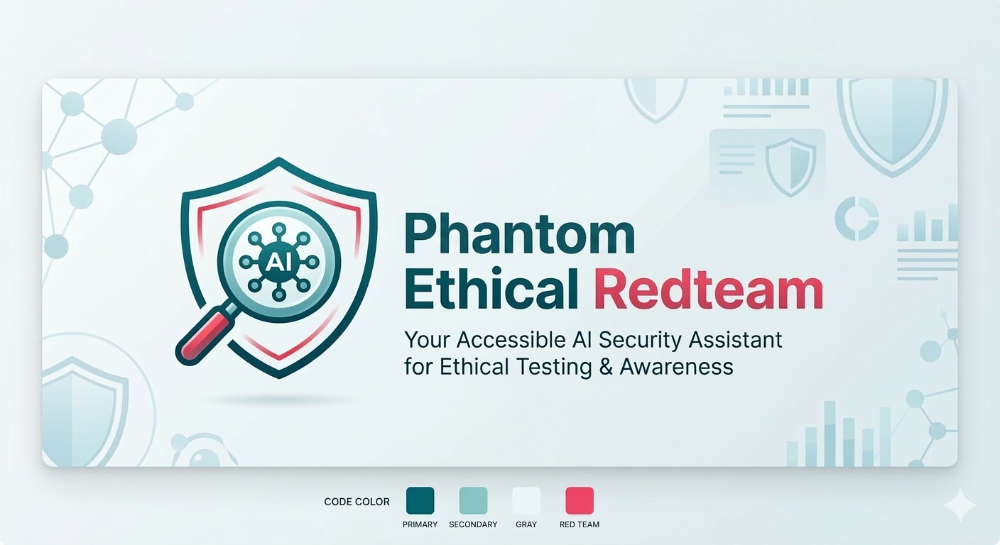

# Phantom – Ethical RedTeam

**Autonomous Red Team agent — works with any LLM**
Uses Nmap, Nuclei, sqlmap, ffuf, WhatWeb, advanced reconnaissance, screenshots, and social engineering templates — on authorized scopes only.

> **Legal notice:** This project is intended solely for lawful security research and authorized testing in controlled environments. Use only on assets you own or are expressly authorized in writing to assess. Nothing in this repository grants authorization to target third-party systems.



---

## Features

- Autonomous agent with step-by-step reasoning + auto-correction
- **20 built-in tools** with native tool-calling on any supported LLM
- **Parallel tool execution** — multiple tools run concurrently
- **Mission resume** — interrupted missions can be resumed from saved state
- **Web dashboard** — real-time monitoring via Flask + WebSocket (port 5000)
- **Multi-target scope** with CIDR support and strict enforcement
- Full structured logging (console + file) + automatic cleanup
- Pause every N turns — human can stop, continue, or force a report
- **Mission diff** — compare findings between sessions (new/resolved/persistent)
- **CVSS scoring** — aggregate risk score from vulnerability findings
- Social engineering limited to educational templates (no actual send)

## Supported LLM Providers

| Provider | Default model (2026-03-15) | API key env var |
|---|---|---|
| Anthropic (Claude) | `claude-sonnet-4-6` | `ANTHROPIC_API_KEY` |
| OpenAI (ChatGPT) | `gpt-5.4` | `OPENAI_API_KEY` |
| xAI (Grok) | `grok-4-20-beta` | `XAI_API_KEY` |
| Google (Gemini) | `gemini-3.0-pro` *(google-genai SDK)* | `GEMINI_API_KEY` |
| Mistral | `mistral-large-latest` | `MISTRAL_API_KEY` |
| DeepSeek | `deepseek-chat-v3.2` | `DEEPSEEK_API_KEY` |
| Ollama (local) | `deepseek-v3.2:cloud` | *(none)* |

## Built-in Tools (20)

### Reconnaissance
| Tool | Description |
|---|---|
| `run_recon` | Passive subdomain discovery (crt.sh + HackerTarget, with retry) |
| `run_nmap` | Port scanning + service detection (quick / service / full / vuln) |
| `run_whatweb` | Web technology fingerprinting (WhatWeb CLI + Python fallback) |

### Scanning & Fuzzing
| Tool | Description |
|---|---|
| `run_nuclei` | CVE / misconfiguration scanning |
| `run_ffuf` | Directory & endpoint fuzzing |
| `run_sqlmap` | SQL injection detection & exploitation |
| `run_payloads` | PayloadsAllTheThings integration (13 attack categories) |

### Exploitation & Network
| Tool | Description |
|---|---|
| `run_bettercap` | Network MITM, ARP probe (Linux only) |
| `run_cyberstrike` | AI-native orchestrator — 100+ tools |

### Evidence & Auth
| Tool | Description |
|---|---|
| `take_screenshot` | Web page screenshot capture (Playwright / wkhtmltoimage / Chromium) |
| `configure_auth` | Auth management — bearer, basic, cookie, custom header (per target) |

### Social Engineering
| Tool | Description |
|---|---|
| `generate_phish_template` | Dynamic email templates — 5 scenarios (educational only) |
| `generate_zphisher_template` | Phishing page templates via Zphisher (educational only) |

### Reporting & Utilities
| Tool | Description |
|---|---|
| `generate_report` | Markdown + HTML + optional PDF report generation |
| `compare_missions` | Diff between two sessions (new / resolved / persistent findings) |
| `read_log` | Read and parse tool output files (nuclei JSONL, ffuf JSON, etc.) |
| `request_human_input` | Pause and ask the operator a question |
| `cleanup_temp` | Remove temporary files (preserves mission reports) |

---

## Installation

### Linux

```bash
chmod +x install.sh
./install.sh
```

```
[ STEP 0 / 3 ] LLM Provider
  1) Anthropic (Claude sonnet-4-6)   2) OpenAI (ChatGPT 5.4)    3) xAI (Grok 4.20 Beta)
  4) Google (Gemini 3)               5) Mistral                  6) DeepSeek 3.2
  7) Ollama (local — deepseek-v3.2:cloud)
Choose provider [1-7] : 1

[ STEP 1 / 3 ] API Key
Enter your ANTHROPIC_API_KEY : sk-ant-...
  → Testing connection... OK

[ STEP 2 / 3 ] Authorized Scope
Target URL : http://dummytarget.com
Authorization note : Pentest contract signed 2026-03-15

[ STEP 3 / 3 ] Installing dependencies...
  Installation complete !
```

> `chmod +x install.sh` is required once after cloning. Phantom launches automatically at the end.

### Windows (PowerShell)

From the Phantom directory, run:

```powershell
.\install.ps1
```

If your execution policy blocks unsigned scripts, use this one-liner instead:

```powershell
& ([scriptblock]::Create((Get-Content .\install.ps1 -Raw)))
```

Same interactive flow (provider -> API key -> scope -> dependencies).
Windows limitations: `bettercap` and `zphisher` require WSL2.

---

## Usage

### Launch a mission

```bash
source .venv/bin/activate
export $(cat .env)
python3 agent/main.py
```

### Resume an interrupted mission

```bash
python3 agent/main.py --resume 20260318_120000
```

Phantom reloads the saved state (messages, turn count) from `logs/<session>/state.json` and continues where it left off.

### Web Dashboard

```bash
pip install flask flask-socketio flask-cors
python -m web.app
```

Open `http://localhost:5000` — real-time terminal output, tool execution timeline, findings summary, session browser, and report viewer.

### Compare missions (remediation tracking)

Phantom can compare two sessions to track remediation progress:

```
Phantom: compare_missions("20260315_120000", "20260318_140000")

Mission Diff: 20260315_120000 -> 20260318_140000
==================================================

## Vulnerability Findings
  Session A: 15 findings | Session B: 8 findings

  NEW (1):
    [+] [HIGH] CVE-2024-1234

  RESOLVED (8):
    [-] [CRITICAL] CVE-2023-2745
    [-] [HIGH] SQLi on /api/users
    ...

  PERSISTENT: 7 findings
```

---

## Real-world example — Web application pentest

### Context

You are a red teamer hired to test the security of `https://someth1ng.com`.
The client has signed a Rules of Engagement document. The scope is limited to this domain and its subdomains.

### Step 1 — Install & configure

Run `./install.sh` and follow the prompts (API key + target URL).

### Step 2 — Launch Phantom

```bash
source .venv/bin/activate
export $(cat .env)
python3 agent/main.py
```

### Step 3 — Phantom reasons and acts autonomously

Phantom works through the standard kill chain, narrating every decision:

```
Phantom: Starting mission on https://someth1ng.com.
  Result: scope confirmed.
  Analysis: I will begin with passive recon before any active scan.
  Next action: run_nmap for port scanning, then run_recon for subdomains.

[TOOL] run_nmap (service scan)
  22/tcp   open  SSH        OpenSSH 8.9
  80/tcp   open  HTTP       Apache 2.4.51
  443/tcp  open  HTTPS      Apache 2.4.51
  3306/tcp open  MySQL      MariaDB 10.6

[TOOL] run_recon
  47 unique subdomains [crt.sh(38), hackertarget(15)]

[TOOL] run_whatweb
  Server: Apache/2.4.51
  CMS/Framework: WordPress
  Security headers MISSING: Content-Security-Policy, X-Frame-Options

[TOOL] run_nuclei
  [CRITICAL] CVE-2023-2745 → https://someth1ng.com/wp-admin/
  [HIGH] CVE-2022-3590 → https://someth1ng.com/xmlrpc.php
  [MEDIUM] Misconfigured xmlrpc.php

[TOOL] run_ffuf
  /admin, /wp-login.php, /api/v1/users, /backup.zip

[TOOL] take_screenshot (evidence capture)
  Screenshot saved: logs/20260318_120000/screenshot_20260318_120512.png

[TOOL] run_sqlmap
  Injection found: UNION-based, 4 columns
  Database: someth1ng_prod (12 tables, 4200 users)
```

After 10 turns, Phantom pauses:

```
Pause after 10 steps.
Enter = continue | 'stop' = stop | 'report' = force report:
```

### Step 4 — Mission complete

```
Phantom: Objectives achieved. Generating final report.

=== MISSION COMPLETE ===

**Executive Summary**
someth1ng.com presents 3 critical vulnerabilities exploitable without authentication.

**Risk Score: 9.2/10 (Critical)**
  Critical: 3 | High: 5 | Medium: 2 | Low: 1

**Critical findings**
1. CVE-2023-2745 — WordPress path traversal → arbitrary file read
2. SQL injection on /api/v1/users?id= → full database dump
3. /backup.zip publicly accessible → database credentials in plaintext

**Recommendations**
- Patch WordPress to 6.5+ immediately
- Parameterize all SQL queries — use prepared statements
- Remove /backup.zip and audit all publicly accessible files
- Enforce TLS on all internal services
```

Reports saved in `logs/<session>/` as Markdown, HTML, and optional PDF.

---

## Configuration

`config.yaml`:

```yaml
provider: "anthropic"        # anthropic | openai | grok | gemini | ollama | mistral | deepseek
model: ""                    # leave empty for provider default
autonomous: true
max_autonomous_turns: 50
pause_every_n_turns: 10
interactive: true

# Performance
max_parallel_tools: 4        # concurrent tool execution
requests_per_second: 5       # rate limit for HTTP calls
retry_max: 3                 # retry attempts for HTTP tools
retry_backoff: 2             # exponential backoff factor

# Timeouts (seconds)
sqlmap_timeout: 300
nmap_timeout: 300
context_compact_after: 5     # truncate old tool results after N turns
```

### Scope file

`scopes/current_scope.md` supports multiple targets, CIDRs, and comments:

```markdown
# Authorized targets
http://dummytarget.com
http://api.dummytarget.com
192.168.1.0/24

# Authorization: Pentest contract signed 2026-03-15
```

---

## Project structure

```
Phantom/
├── agent/
│   ├── main.py                 # Entry point + session orchestration
│   ├── agent_client.py         # Agentic loop + parallel tool execution
│   ├── providers/              # Multi-LLM abstraction (7 providers)
│   ├── tools/                  # 20 tool implementations
│   │   ├── nmap_scan.py        # Port scanning + service detection
│   │   ├── nuclei.py           # CVE scanning
│   │   ├── ffuf.py             # Directory fuzzing
│   │   ├── sqlmap.py           # SQL injection
│   │   ├── recon.py            # Subdomain discovery
│   │   ├── whatweb_tool.py     # Technology fingerprinting
│   │   ├── screenshot.py       # Evidence capture
│   │   ├── auth_manager.py     # Authentication management
│   │   ├── mission_diff.py     # Session comparison
│   │   ├── report.py           # Report generation (MD/HTML/PDF)
│   │   ├── cvss_scorer.py      # Risk scoring utility
│   │   ├── http_utils.py       # Retry with backoff
│   │   ├── rate_limiter.py     # Token-bucket rate limiter
│   │   └── ...                 # + bettercap, cyberstrike, payloads, etc.
│   └── utils/
│       └── validation.py       # Input sanitization + validation
├── web/                        # Web dashboard (Flask + SocketIO)
│   ├── app.py
│   ├── templates/
│   └── static/
├── tests/                      # 44 unit tests
├── config.yaml
├── prompts/system_prompt.txt
├── scopes/current_scope.md
├── install.sh / install.ps1
└── requirements.txt
```

---

## Legal

This tool is for authorized penetration testing only. Running it against systems you do not have written permission to test is illegal. The authors are not responsible for misuse.
